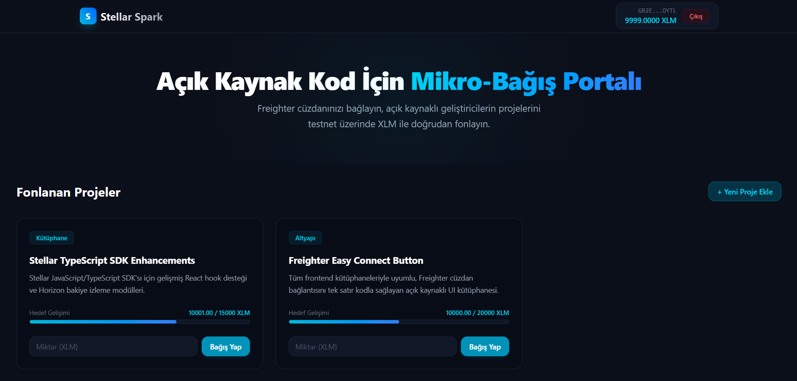
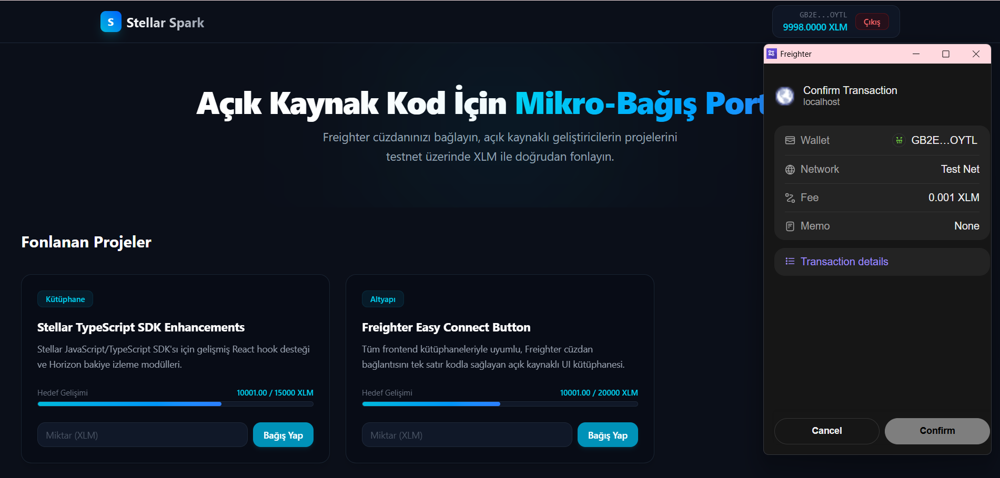
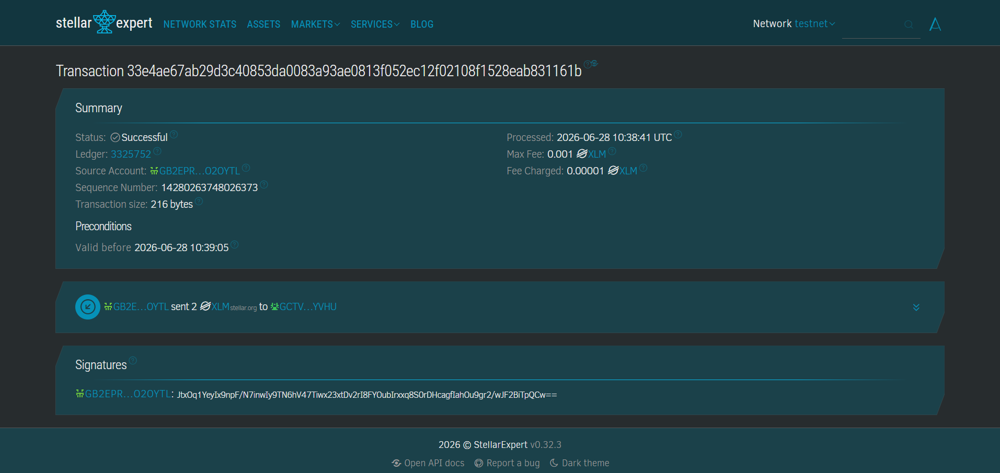
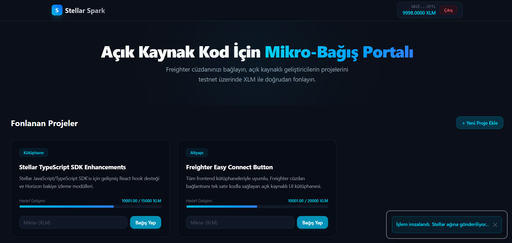

# Stellar Spark - Open Source Micro-Donation Hub

Stellar Spark is a decentralized micro-donation dApp built on the Stellar Testnet. It is designed to allow developers and supporters to fund open-source projects using testnet XLM via the Freighter Wallet browser extension.

This project successfully fulfills all the requirements of **Level 1 – White Belt** of the Stellar dApp Development program.

---

## 🌟 Key Features

1. **Freighter Wallet Integration:**
   * Seamless connect and disconnect functionality.
   * Prompts user for wallet access authorization using Freighter v6 `requestAccess` API.
2. **On-Chain Balance Management:**
   * Live fetching of the connected user's XLM balance directly from the Stellar Horizon API.
   * Real-time balance updates for each listed project card.
3. **Dynamic Crowdfunding Dashboard:**
   * Interactive progress bars showing funding percentages relative to target goals.
   * Community project creation modal with strict validation of Stellar public key formats.
4. **On-Chain Transaction Execution:**
   * Prepares payment transactions using `TransactionBuilder`.
   * Requests secure signatures from Freighter browser extension.
   * Submits signed transactions to Horizon Testnet node and outputs click-to-view transaction hashes (linked to Stellar Expert Explorer).
5. **Robust Quality Controls:**
   * Complete Vitest unit test suite covering connection states, balance fetching, and ui rendering.
   * Clean compilation under production build bundles.

---

## 🛠️ Tech Stack

* **Frontend Framework:** React 18 + Vite (TypeScript)
* **Styling:** TailwindCSS v4
* **Stellar Libraries:**
  * `@stellar/freighter-api` (v6 Wallet connection & transaction signing)
  * `@stellar/stellar-sdk` (v13 Transaction building & Horizon queries)
* **Testing:** Vitest & React Testing Library
* **State & Cache:** React State & Browser Local Storage

---

## 🚀 Setup & Installation Instructions

Follow these steps to run the project locally on your machine:

### Prerequisites
* Ensure you have [Node.js](https://nodejs.org/) installed (v18 or higher recommended).
* Install the **Freighter Wallet extension** on your browser ([Freighter Wallet](https://www.freighter.app/)).

### 1. Clone the repository and navigate into the directory:
```bash
git clone <your-repository-url>
cd stellar-donation-hub
```

### 2. Install dependencies:
```bash
npm install
```

### 3. Start local development server:
```bash
npm run dev
```
Open your browser and navigate to the address shown in the terminal (usually `http://localhost:5173`).

### 4. Build for production:
```bash
npm run build
```

### 5. Run tests:
```bash
npm run test:run
```

## 📸 Screenshots (White Belt Requirements)

*Please replace the placeholders below with actual screenshots of your running application for submission:*

### 1. Wallet Connected State


### 2. Balance Displayed


### 3. Successful Testnet Transaction


### 4. The Transaction Result is Shown to the User

